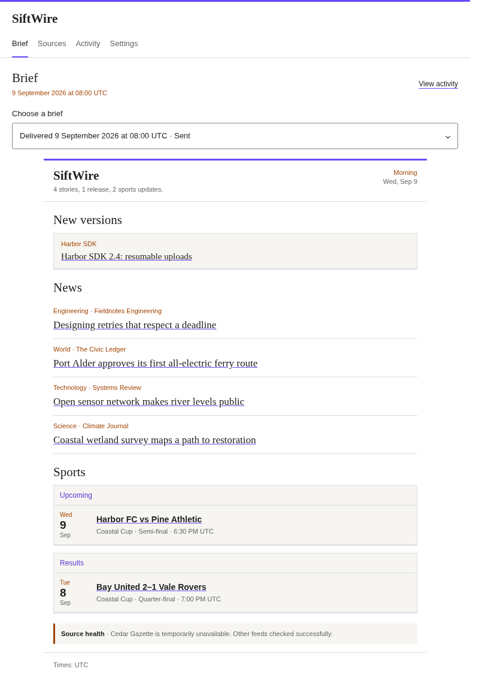

# SiftWire

SiftWire turns your chosen feeds, GitHub releases, and sports schedules into a
brief. Your agent chooses the optional stories and sends the prepared message
through its own tools.



*Synthetic example. Not a live brief or a record of delivery.*

Major and Highlights feeds supply stories published in the last 24 hours, with
original feed links. Required feeds track new entries instead. GitHub releases
are always Required. Sports have separate upcoming-fixture and result windows.
Exact duplicate checks and confirmed-delivery history help reduce repeats.
They do not identify every version of an event or verify article contents.

SiftWire saves the selected brief as immutable Markdown, plain text, and HTML.
It records delivery after your agent confirms transport acceptance, so you can
inspect what was collected, excluded, selected, and sent. The optional
[console](docs/console.md) reads saved briefs and edits configuration.

The runner and its SQLite database stay local. Your agent supplies editorial
judgment, scheduling, and delivery tools. SiftWire has no scheduler or email
service. Feed coverage depends on what your sources publish and retain.

## Install

Install the latest published runner:

```bash
sh -c "$(curl -fsSL https://github.com/yazanabuashour/siftwire/releases/latest/download/install.sh)"
siftwire --version
```

The latest documented release is v0.8.0. This checkout introduces an unreleased
[compatibility reset](docs/runner-v5-reset.md); do not pair its skill or console
with v0.8.0. The pinned release installer is:

```bash
SIFTWIRE_VERSION=v0.8.0 sh -c "$(curl -fsSL https://github.com/yazanabuashour/siftwire/releases/download/v0.8.0/install.sh)"
siftwire --version
```

Register the matching `skills/siftwire/SKILL.md` with your agent's native skill
system. For v0.8.0, use the `v0.8.0` repository tag or the release asset
`siftwire_0.8.0_skill.tar.gz`. Installation is not complete until both the runner
and its matching skill are installed. No particular agent or skill directory is
required.

The installer accepts no arguments. `SIFTWIRE_VERSION` selects the release.
`SIFTWIRE_INSTALL_DIR` selects the executable directory. Follow any printed
`PATH` instruction before verifying the runner.

## Configure your brief

Ask your agent to propose sources and reporting choices, then approve the
configuration before it writes anything. A fresh database has no sources.
The [agent skill](skills/siftwire/SKILL.md) covers configuration and delivery.

For direct process integration, each command reads one JSON request from stdin
and returns one JSON result:

```bash
printf '%s\n' '{"action":"init"}' | siftwire config
printf '%s\n' '{"action":"inspect_config"}' | siftwire config
```

The default database is
`${XDG_DATA_HOME:-~/.local/share}/siftwire/siftwire.sqlite`. `XDG_DATA_HOME` must be
absolute. Use `SIFTWIRE_DATABASE_PATH` for another database, or `--db` for an
explicit dataset. Keep configuration, databases, and delivery history outside
this repository. See the [runner contract](docs/runner-contract.md) for actions,
result fields, and retry rules.

## Upgrade this checkout

This checkout removes backward compatibility and requires a fresh database.
Follow the [compatibility reset](docs/runner-v5-reset.md). The
[v4 migration guide](docs/runner-v4-migration.md) describes the published v0.8.0
release only.

Update the runner, matching skill, and process consumers together. If you use
the console, update it and its web assets too. Published release tags keep their
original contracts.

## Find a task

- [Read run and delivery history](docs/run-history.md)
- [Use the optional console](docs/console.md)
- [Integrate the JSON runner](docs/runner-contract.md)
- [Understand current-news selection](docs/architecture/current-news.md)
- [Develop and run checks](CONTRIBUTING.md)
- [Verify release assets](docs/release-verification.md)
- [Report a vulnerability privately](SECURITY.md)

The [documentation index](docs/README.md) links to migration, architecture, and
evaluation guidance.
